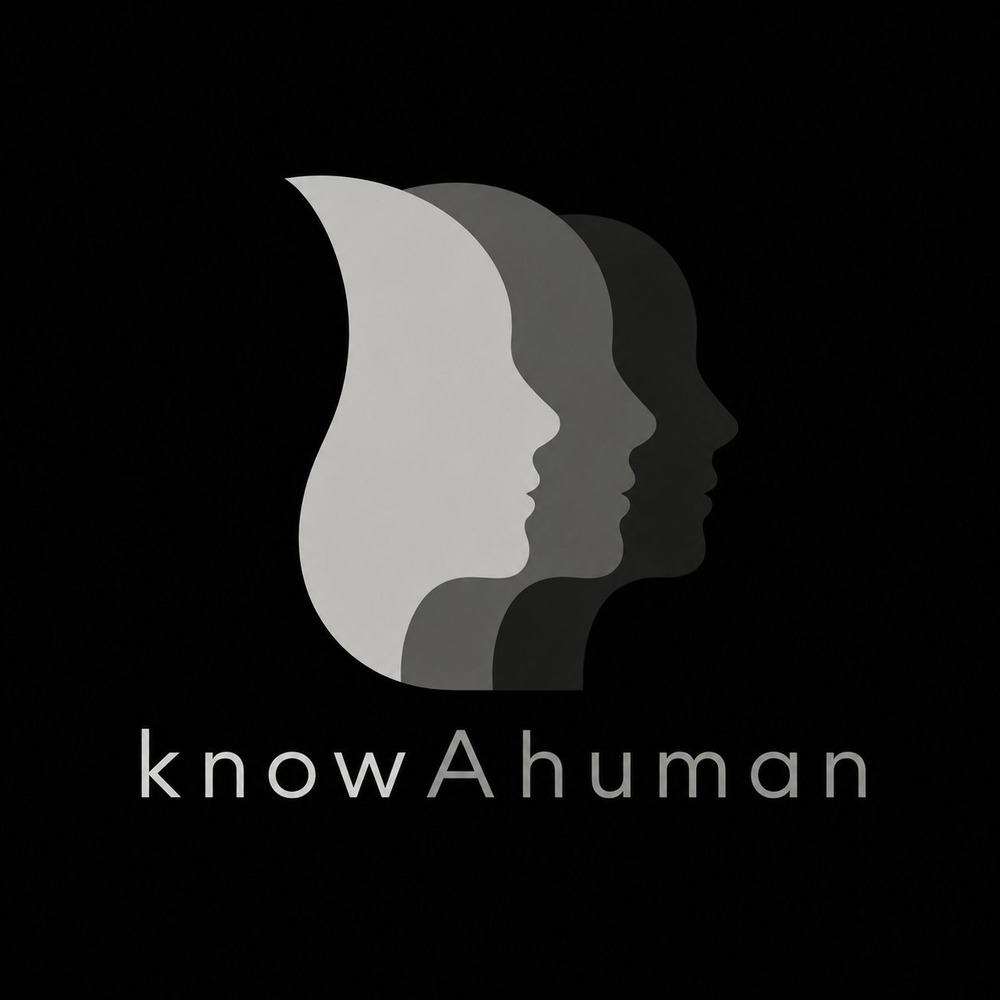

# Know A Human - Conectate con las personas correctas en la era de la IA

**Platanus Hack 26 | Equipo 24 | Buenos Aires | Track: Future**



---

## Equipo

- **Marcos Penon** ([@mpenon4](https://github.com/mpenon4))
- **Roman Pedro Meclazcke** ([@romanmeclazcke](https://github.com/romanmeclazcke))
- **Lautaro Guiglioni** ([@Lautaroguiglioni](https://github.com/Lautaroguiglioni))
- **Alejandro Cafaro** ([@AleCafaro](https://github.com/AleCafaro))
- **Luca Saboredo** ([@Lucasaboredo](https://github.com/Lucasaboredo))

---

## El futuro no se trata solo de saber crear, se trata de saber con quién construir

Know A Human es una plataforma que conecta personas a través de aquello que las hace humanas.

En un mundo donde la inteligencia artificial permite que cada vez más personas puedan programar, diseñar, crear y lanzar productos digitales, las habilidades técnicas ya no son el único diferencial.

Hoy, el valor real empieza a venir de encontrar personas compatibles: personas con valores, personalidades, creatividad, formas de pensar y objetivos alineados.

**Nuestro objetivo:** transformar el networking tradicional en conexiones humanas reales, ayudando a las personas a encontrar candidatos, socios, equipos y comunidades compatibles.

**Probá nuestra plataforma en vivo acá:**  
https://knewa-human.vercel.app/landing

---

## Por qué tenés que votarnos

### Un problema real, una nueva forma de conectar

La inteligencia artificial está democratizando las habilidades técnicas. Cada vez más personas pueden crear productos, escribir código, diseñar interfaces o automatizar tareas.

Pero eso abre una nueva pregunta:

**Si todos pueden construir con IA, qué nos hace realmente diferentes?**

Know A Human responde a ese problema enfocándose en lo que la IA no puede copiar fácilmente: la forma en que una persona piensa, crea, colabora y se relaciona con otros.

---

### Networking real, no conexiones vacías

Hoy existen muchas plataformas para mostrar experiencia, educación o habilidades técnicas. Pero muy pocas ayudan a las personas a entender si dos personas son realmente compatibles para trabajar juntas, crear algo o formar un equipo.

Know A Human busca resolver eso conectando personas según:

- Personalidad
- Valores
- Creatividad
- Compatibilidad
- Habilidades blandas
- Objetivos
- Estilo de colaboración
- Forma de pensar

---

### Creado para personas que quieren construir algo real

Nuestro enfoque está diseñado para emprendedores, desarrolladores, diseñadores, recruiters, startups, equipos de hackathon y comunidades que necesitan encontrar personas compatibles para crear proyectos.

No se trata solo de encontrar a alguien que sepa hacer algo.

Se trata de encontrar a la persona correcta para construirlo con vos.

---

## Funcionalidades principales de Know A Human

| Funcionalidad | Por qué importa |
|---|---|
| Perfil humano para cada persona | Ayuda a entender a otros más allá de las habilidades técnicas tradicionales. |
| Compatibilidad entre usuarios | Ayuda a encontrar personas alineadas en valores, objetivos y formas de trabajo. |
| Foco en habilidades blandas | Destaca aspectos como comunicación, creatividad, colaboración y personalidad. |
| Ideal para construir equipos | Útil para hackathons, startups, proyectos, comunidades y networking profesional. |
| Conexiones más auténticas | Busca reemplazar el networking superficial por relaciones más significativas. |
| Diseñado para la era de la IA | En un futuro donde todos pueden crear con IA, encontrar a las personas correctas será clave. |

---

## Queremos tu apoyo

Estamos participando en esta hackathon para mostrar cómo la inteligencia artificial no solo puede ayudarnos a crear más rápido, sino también a conectar mejor.

Creemos que el futuro no dependerá solamente de quién sabe programar, diseñar o construir.

El futuro dependerá de quién logra rodearse de las personas correctas.

**Votá a Know A Human y ayudanos a transformar el networking en compatibilidad humana.**

**Votanos acá:**  
https://hack.platan.us/26-ar/live?fbclid=PAdGRleARtsSBleHRuA2FlbQIxMQBzcnRjBmFwcF9pZA8xMjQwMjQ1NzQyODc0MTQAAafXJTK4Q29uNLaJ3q74ys5MqLWX2kXvhJtTUaOcEuE8gD8bvR2SlW3M4DTlJw_aem_oH-RHqisRHi6WK2lH43h_Q

---

## Cómo Know A Human marca la diferencia

### Hoy

- La inteligencia artificial está haciendo que las habilidades técnicas sean cada vez más accesibles.
- Crear productos digitales ya no depende solo de saber programar.
- Muchas conexiones profesionales siguen siendo superficiales.
- Construir equipos compatibles todavía es difícil.
- El networking tradicional suele basarse en contactos, no en compatibilidad real.

### Con Know A Human

- Ayudamos a las personas a encontrar gente compatible para construir proyectos.
- Valoramos las habilidades humanas que la IA no puede copiar fácilmente.
- Hacemos más fácil formar equipos, comunidades y alianzas.
- Transformamos el networking en conexiones más reales y útiles.
- Priorizamos personalidad, valores, creatividad y colaboración.

---

## Nueva visión

En un futuro donde la inteligencia artificial potencia a todos, el verdadero diferencial será encontrar a las personas correctas.

Know A Human nació con esa visión: ayudar a las personas a conectar no solo por lo que saben hacer, sino por cómo piensan, cómo crean, cómo colaboran y cómo se relacionan con otros.

---

## Frase principal

> **Know A Human conecta personas a través de aquello que la inteligencia artificial no puede copiar fácilmente:**  
> **su forma de pensar, crear, colaborar y relacionarse con otros.**

---

## Público objetivo

Know A Human está diseñado para:

- Emprendedores
- Desarrolladores
- Diseñadores
- Startups
- Recruiters
- Equipos de hackathon
- Comunidades tech
- Personas que buscan socios
- Personas que quieren networking real
- Personas que quieren construir proyectos con otros

---

# Sección técnica

## Descripción del proyecto

Know A Human es una plataforma inteligente de matching para talento, profesionales, founders y startups.

El sistema permite a los usuarios crear perfiles de candidatos y startups, analizar compatibilidad y generar conexiones basadas en habilidades, experiencia, tecnologías y compatibilidad humana.

**Estado:** MVP desarrollado para Platanus Hack 26.

---

## Arquitectura

```txt
knowAhuman/
|-- services/api/                    # Backend Express + TypeScript
|   |-- src/
|   |   |-- controllers/             # Controladores de requests
|   |   |-- services/                # Lógica de negocio
|   |   |-- routes/                  # Endpoints de API
|   |   |-- middlewares/             # Auth, validación, errores
|   |   |-- config/                  # Supabase, entorno
|   |   |-- types/                   # Interfaces TypeScript
|   |   `-- utils/                   # JWT, bcrypt, validadores
|   |-- FRONTEND_API_GUIDE.md
|   `-- package.json
|
|-- apps/web/                        # Frontend Next.js
|   |-- app/
|   |-- components/
|   |-- lib/
|   `-- package.json
|
|-- openclaw/                        # Runtime OpenClaw
`-- back/                            # Backend mínimo para runtime
```

---

## Stack

- **Frontend:** Next.js
- **Backend:** Express + TypeScript
- **Base de datos:** Supabase
- **Runtime de IA:** OpenClaw
- **Deploy:** Vercel / Railway

---

## Seguridad

Este repositorio no debe incluir claves reales, tokens privados ni archivos `.env` con credenciales.

Para configurar el entorno local, usá los archivos de ejemplo y completá los valores reales solo en archivos locales ignorados por git.

Archivos de referencia:

- `.env.example`
- `.env.backend.template`
- `.env.frontend.template`
- `services/api/.env.example`
- `openclaw.runtime.env.example`

---

# Know A Human - Connect with the right people in the AI era

**Platanus Hack 26 | Team 24 | Buenos Aires | Track: Future**


---

## Team

- **Marcos Penon** ([@mpenon4](https://github.com/mpenon4))
- **Roman Pedro Meclazcke** ([@romanmeclazcke](https://github.com/romanmeclazcke))
- **Lautaro Guiglioni** ([@Lautaroguiglioni](https://github.com/Lautaroguiglioni))
- **Alejandro Cafaro** ([@AleCafaro](https://github.com/AleCafaro))
- **Luca Saboredo** ([@Lucasaboredo](https://github.com/Lucasaboredo))

---

## The future is not only about knowing how to create, it is about knowing who to build with

Know A Human is a platform that connects people through what makes them human.

In a world where artificial intelligence allows more and more people to program, design, create, and launch digital products, technical skills are no longer the only differentiator.

Today, real value is starting to come from finding compatible people: people with aligned values, personalities, creativity, ways of thinking, and goals.

**Our goal:** transform traditional networking into real human connections, helping people find compatible candidates, partners, teams, and communities.

**Try our live platform here:**  
https://knewa-human.vercel.app/landing

---

## Why you need to vote for us

### A real problem, a new way to connect

Artificial intelligence is democratizing technical skills. More and more people can create products, write code, design interfaces, or automate tasks.

But that opens up a new question:

**If everyone can build with AI, what really makes us different?**

Know A Human answers that problem by focusing on what AI cannot easily copy: the way a person thinks, creates, collaborates, and relates to others.

---

### Real networking, not empty connections

Today, there are many platforms for showcasing experience, education, or technical skills. But very few help people understand whether two people are truly compatible to work together, create something, or form a team.

Know A Human aims to solve that by connecting people based on:

- Personality
- Values
- Creativity
- Compatibility
- Soft skills
- Goals
- Collaboration style
- Way of thinking

---

### Built for people who want to create something real

Our approach is designed for entrepreneurs, developers, designers, recruiters, startups, hackathon teams, and communities that need to find compatible people to create projects.

It is not just about finding someone who knows how to do something.

It is about finding the right person to build it with you.

---

## Key features of Know A Human

| Feature | Why it matters |
|---|---|
| Human profile for each person | Helps people understand others beyond traditional technical skills. |
| User compatibility | Helps find people aligned in values, goals, and ways of working. |
| Focus on soft skills | Highlights aspects such as communication, creativity, collaboration, and personality. |
| Ideal for building teams | Useful for hackathons, startups, projects, communities, and professional networking. |
| More authentic connections | Aims to replace superficial networking with more meaningful relationships. |
| Designed for the AI era | In a future where everyone can create with AI, finding the right people will be key. |

---

## We want your support

We are participating in this hackathon to show how artificial intelligence can not only help us create faster, but also connect better.

We believe the future will not depend only on who knows how to program, design, or build.

The future will depend on who manages to surround themselves with the right people.

**Vote for Know A Human and help us transform networking into human compatibility.**

**Vote for us here:**  
https://hack.platan.us/26-ar/live?fbclid=PAdGRleARtsSBleHRuA2FlbQIxMQBzcnRjBmFwcF9pZA8xMjQwMjQ1NzQyODc0MTQAAafXJTK4Q29uNLaJ3q74ys5MqLWX2kXvhJtTUaOcEuE8gD8bvR2SlW3M4DTlJw_aem_oH-RHqisRHi6WK2lH43h_Q

---

## How Know A Human makes a difference

### Today

- Artificial intelligence is making technical skills increasingly accessible.
- Creating digital products no longer depends only on knowing how to code.
- Many professional connections remain superficial.
- Building compatible teams is still difficult.
- Traditional networking is often based on contacts, not real compatibility.

### With Know A Human

- We help people find compatible people to build projects.
- We value the human skills that AI cannot easily copy.
- We make it easier to form teams, communities, and partnerships.
- We transform networking into more real and useful connections.
- We prioritize personality, values, creativity, and collaboration.

---

## New vision

In a future where artificial intelligence empowers everyone, the real differentiator will be finding the right people.

Know A Human was born with that vision: helping people connect not only through what they know how to do, but through how they think, how they create, how they collaborate, and how they relate to others.

---

## Main phrase

> **Know A Human connects people through what artificial intelligence cannot easily copy:**  
> **their way of thinking, creating, collaborating, and relating to others.**

---

## Target audience

Know A Human is designed for:

- Entrepreneurs
- Developers
- Designers
- Startups
- Recruiters
- Hackathon teams
- Tech communities
- People looking for partners
- People who want real networking
- People who want to build projects with others

---

# Technical Section

## Project Overview

Know A Human is an intelligent matching platform for talent, professionals, founders, and startups.

The system allows users to create candidate and startup profiles, analyze compatibility, and generate connections based on skills, experience, technologies, and human compatibility.

**Status:** MVP developed for Platanus Hack 26.

---

## Architecture

```txt
knowAhuman/
|-- services/api/                    # Express + TypeScript backend
|   |-- src/
|   |   |-- controllers/             # Request handlers
|   |   |-- services/                # Business logic
|   |   |-- routes/                  # API endpoints
|   |   |-- middlewares/             # Auth, validation, errors
|   |   |-- config/                  # Supabase, environment
|   |   |-- types/                   # TypeScript interfaces
|   |   `-- utils/                   # JWT, bcrypt, validators
|   |-- FRONTEND_API_GUIDE.md
|   `-- package.json
|
|-- apps/web/                        # Next.js frontend
|   |-- app/
|   |-- components/
|   |-- lib/
|   `-- package.json
|
|-- openclaw/                        # OpenClaw runtime
`-- back/                            # Minimal backend for runtime
```

---

## Stack

- **Frontend:** Next.js
- **Backend:** Express + TypeScript
- **Database:** Supabase
- **AI Runtime:** OpenClaw
- **Deploy:** Vercel / Railway

---

## Security

This repository must not include real keys, private tokens, or `.env` files with credentials.

To configure the local environment, use the example files and fill in the real values only in local files ignored by git.

Reference files:

- `.env.example`
- `.env.backend.template`
- `.env.frontend.template`
- `services/api/.env.example`
- `openclaw.runtime.env.example`
